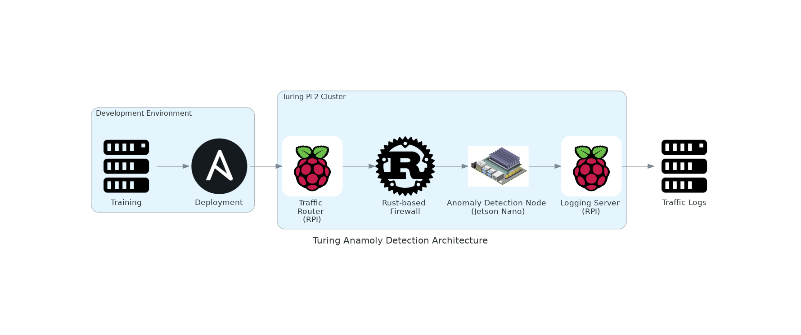

# TuringAnamolyDetection
## Overview
A lightweight, secure IoT gateway leveraging the Turing Pi 2 cluster (1 Jetson Nano + 2 Raspberry Pi CM4 modules). This project integrates:
- A Rust-based firewall for traffic monitoring and filtering.
- An anomaly detection engine using TensorFlow Lite deployed on the Jetson Nano.
- Secure communication between components via MQTT with TLS.
- A real-time dashboard for monitoring traffic and alerts.

## Features
- **Rust-Based Firewall:** Enforces dynamic traffic rules and monitors network activity.
- **Anomaly Detection:** Detects unauthorized access, port scans, and unusual traffic using a lightweight ML model.
- **Secure Communication:** Utilizes MQTT with TLS for secure inter-component messaging.
- **Real-Time Dashboard:** Provides live stats and anomaly alerts.

## Architecture


### Components
1. **Traffic Router (Raspberry Pi CM4 - Node 1):** Handles traffic routing and firewalling.
2. **Logging Server (Raspberry Pi CM4 - Node 2):** Aggregates and visualizes traffic data.
3. **Anomaly Detection Node (Jetson Nano):** Hosts and executes the TensorFlow Lite model.

## Milestones
1. Set up the Turing Pi 2 hardware.
2. Implement the Rust-based firewall.
3. Deploy the TensorFlow Lite model.
4. Establish secure MQTT communication.
5. Build and deploy the monitoring dashboard.

## Getting Started
### Prerequisites
- **Hardware:** Turing Pi 2 with 1 Jetson Nano and 2 Raspberry Pi CM4 modules.
- **Software:** Rust, Python (with TensorFlow), MQTT broker (e.g., Mosquitto).

### Quick Start
1. Clone the repository:
    ```bash
    git clone https://github.com/<your-username>/IoT-Security-Gateway.git
    cd IoT-Security-Gateway
    ```
2. Follow the [Setup Guide](docs/setup-guide.md) to initialize the environment.

## Contributing
Contributions are welcome! Please check the [Contribution Guidelines](CONTRIBUTING.md).

## License
This project is licensed under the MIT License - see the [LICENSE](LICENSE) file for details.